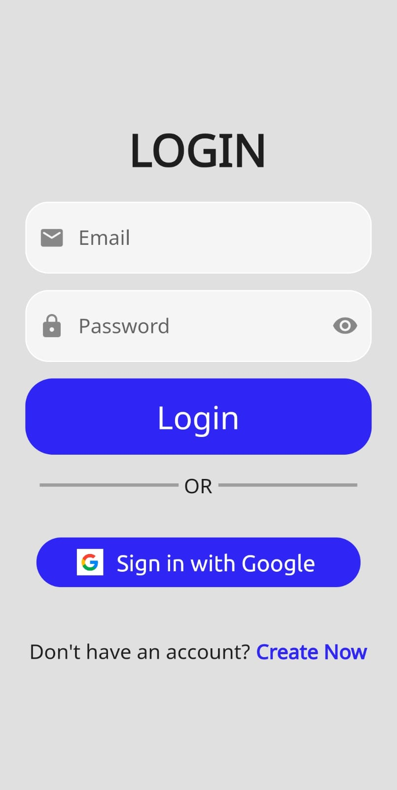
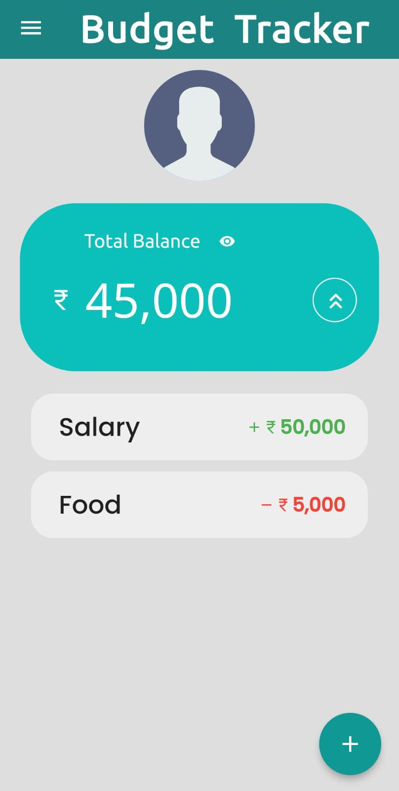
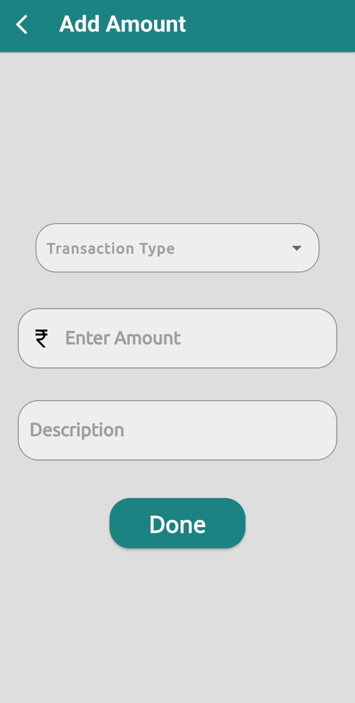
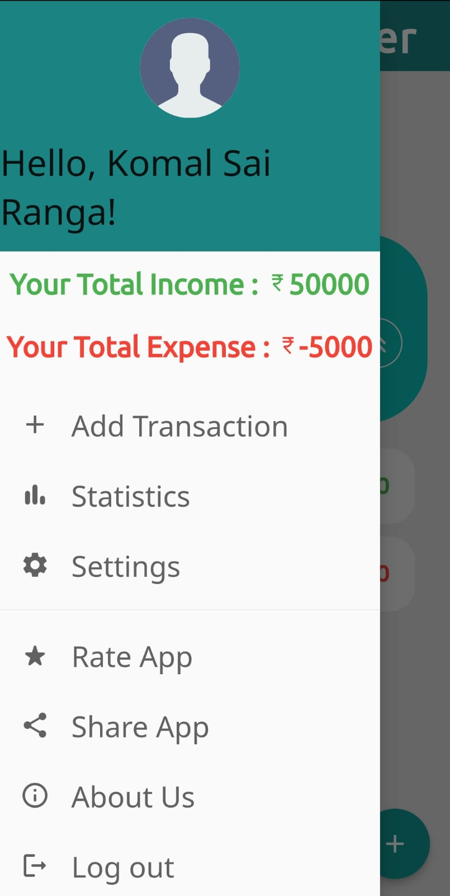
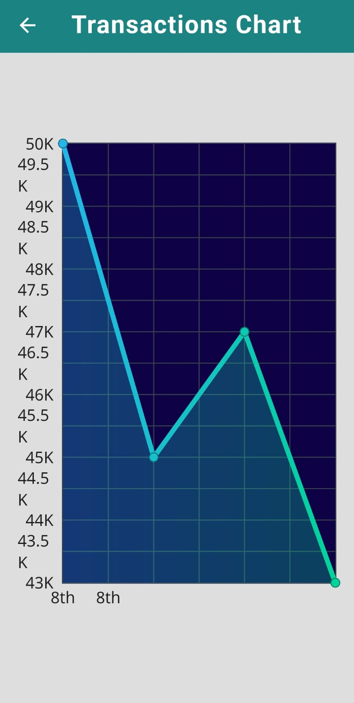

# Budget Tracker App

Welcome to Budget Tracker App! This app helps you manage your finances by tracking your income and expenses, enabling you to make informed financial decisions. Keep your budget in check and take control of your financial journey with this user-friendly application.
## Features
 - Login to your account and keep track of your transactions.
 - See the statistics of your income and expenses.
 - Can delete a transaction if added by mistake
 
## Screenshots

